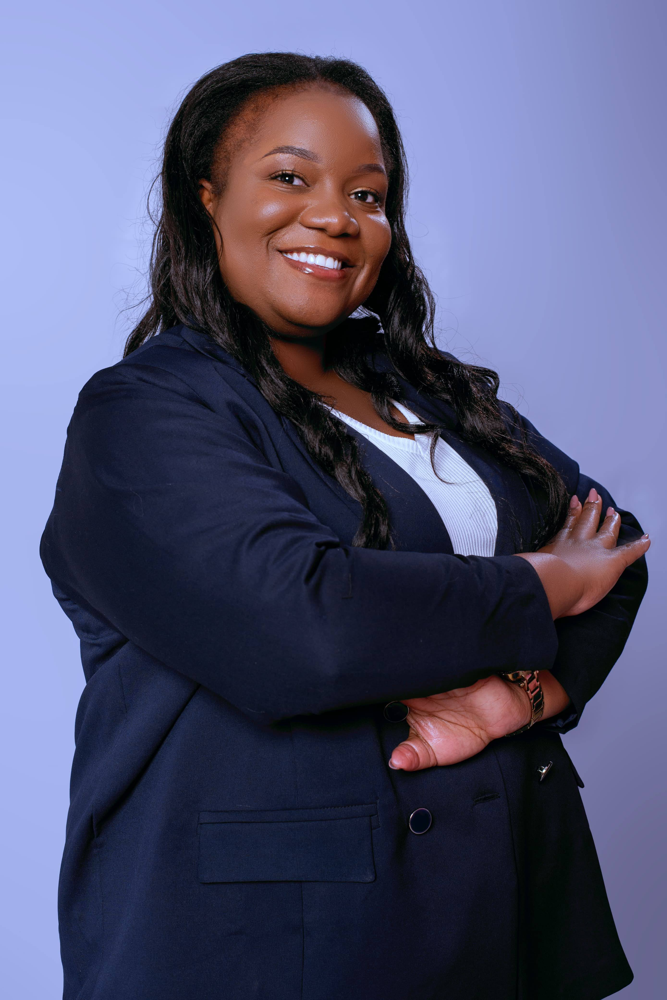
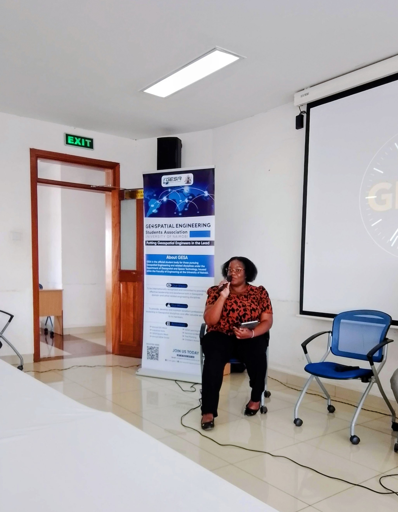

```md
---
hide:
  - toc
  - navigation
---

<div class="hero">
  

  <h1>Daniella Grace Adhiambo</h1>

  <p><strong>Land Surveyor | Licensed Drone Pilot</strong></p>

  <p><em>Smart Mapping for a Changing World | Land Survey | Drone Mapping | GIS</em></p>
</div>

## About Me

<div class="about-section" markdown>

<div class="about-text" markdown>

I am a Land Surveyor and Licensed Drone Pilot with a strong background in land surveying and a growing specialization in GIS, drone mapping, and spatial data analysis. I focus on geospatial data collection and modern mapping technologies to produce accurate spatial information that supports planning and informed decision-making.

My interests lie in integrating modern survey technology, GIS, and mapping systems to develop efficient solutions for real-world spatial challenges. Beyond technical practice, I enjoy sharing knowledge, engaging with diverse audiences, and continuously expanding my expertise in geospatial innovation and advanced spatial analysis.

</div>

<div class="about-image">
  
</div>

</div>

[View My Projects :material-arrow-right:](projects/index.md){ .md-button .md-button--primary }
[Download CV :material-download:](assets/Daniella_Grace_Adhiambo_CV.pdf){ .md-button }

---

## Skills

<div class="grid cards" markdown>

### Technical Skills

- Geographic Information Systems (GIS)
- Land Surveying
- Remote Sensing
- Image Processing
- Drone Mapping and UAV Operations
- Spatial Data Analysis

### GIS Skills

- Spatial Data Analysis
- Geospatial Data Collection
- Cartography & Map Design
- Map Interpretation
- Spatial Intelligence
- Digital Mapping
- QGIS
- ArcGIS
- Google Earth Pro

### Land Survey Skills

- GPS & GNSS Surveying
- Topographic Mapping
- Field Data Collection
- AutoCAD

### Drone Mapping & UAV Operations

- Mission Planning and Flight Operations
- Photogrammetry
- Pix4D
- DroneDeploy
- Remote Sensing
- Image Processing

### Professional Skills

- Communication
- Team Collaboration
- Problem Solving
- Attention to Detail
- Time Management
- Adaptability
- Leadership
- Project Coordination

</div>

---

## Connect

[GitHub](https://github.com/daniallaadhiambo3-lab){ .md-button }

[LinkedIn](https://linkedin.com/in/Daniella (Grace) Adhiambo){ .md-button }
```
